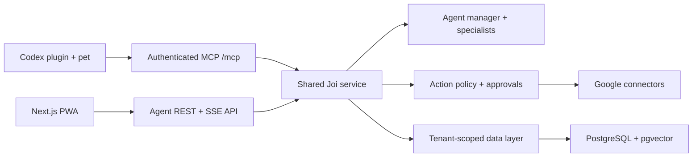

# Joi — AI daily companion and Codex pet

Joi is a productivity-led AI companion built around the existing soft 3D chibi Codex pet. The repository now contains one shared TypeScript agent core, an approval-first MCP server, a Codex plugin, and a responsive web/PWA client.

Joi always identifies as AI. It is inspired by a supplied character, not an impersonation of a real person. The original reference photographs are not included.


## What works now

- Streaming chat through an OpenAI Agents SDK manager and five specialist agents when `OPENAI_API_KEY` is configured.
- A deterministic no-key demo mode with realistic mock Gmail, Calendar, and Drive data.
- Typed tasks, explicit memory, approval, automation, audit, profile, connector, event, and capability contracts.
- Exact-preview approval for email sends and calendar creation. Destructive and financial actions are blocked.
- A stateless Streamable HTTP MCP server with `joi.*` tool namespaces.
- An installable Codex plugin with ten `$joi-*` skills and the animated pet package.
- A Next.js PWA with chat, tasks, memory, approvals, routines, settings, and avatar state synchronization.
- A separate native macOS floating companion with an AssistiveTouch-style radial menu, a ChatGPT Voice browser handoff, resizable avatar, Pomodoro, Google search, Codex launching, current-source media controls, automatic music-aware dancing, and a native right-click **Close Joi** command.
- PostgreSQL/pgvector schema with row-level tenant isolation and a queue-ready automation table.
- A 131-ID feature registry that separates the planned MVP from the implemented beta subset; unavailable features remain visibly gated.

This is a runnable engineering beta, not a public-production release. See [implementation status](docs/IMPLEMENTATION_STATUS.md) for the remaining release gates.

## Architecture



The beta runs an in-memory repository and mock Google connectors by default. The migration in `database/migrations` is the production persistence contract; wiring a deployed Postgres adapter and encrypted OAuth token store remains a release gate.

## Run locally

Requirements: Node.js 22+, pnpm 10+, and Codex for plugin testing.

```bash
corepack enable
pnpm install
cp .env.example .env
pnpm dev
```

Open [http://localhost:3000](http://localhost:3000). The agent health endpoint is [http://localhost:8787/health](http://localhost:8787/health).

Without an OpenAI key, Joi runs the safe deterministic demo. Add `OPENAI_API_KEY` to `.env` to use the real agent manager. Model IDs are configurable with `OPENAI_FAST_MODEL` and `OPENAI_STRONG_MODEL`.

Useful commands:

```bash
pnpm dev:agent
pnpm dev:web
pnpm check
docker compose up --build
```

## Install the pet only

macOS or Linux:

```bash
chmod +x install.sh
./install.sh
```

Windows:

```powershell
powershell -ExecutionPolicy Bypass -File .\install.ps1
```

Restart Codex and choose **Joi** in the pet selector. The default destination is `~/.codex/pets/joi` on macOS/Linux and `%USERPROFILE%\.codex\pets\joi` on Windows.

## Install the Joi Codex plugin

See the [plugin walkthrough](plugins/joi-assistant/README.md). The short version for a merged public release is:

```bash
codex plugin marketplace add AmirTheDude69/Joi --ref main
codex plugin add joi-assistant@joi
```

Then start the local agent, make `JOI_DEV_AUTH_TOKEN` available to the Codex process, install the bundled pet, restart Codex, and test `$joi-setup` in a new task.

## Install the standalone macOS app

Build the universal DMG on macOS:

```bash
pnpm build:macos
```

Or use the checked-in private-beta installer: [Joi 0.7.0 universal DMG](releases/Joi-0.7.0-macOS-Universal.dmg).

Open `releases/Joi-0.7.0-macOS-Universal.dmg`, drag Joi to Applications, then Control-click **Joi** and choose **Open** on first launch. Click the avatar to reveal transparent glass radial controls and the icon-only watch-style music cluster. Magnetic hover applies to every floating button, inactive controls auto-close after a configurable delay, Focus supports ten active tasks plus a persistent Archive, and Settings provides separate Avatar Size and Control Radius sliders. Voice opens the official ChatGPT website without showing a local handoff card; select ChatGPT's Voice icon once and allow browser microphone access. The music cluster follows the current macOS Now Playing source, changes between Play and Pause in real time, and starts or stops Joi's standalone dance as the source's actual playback state changes.

See the full [macOS walkthrough](apps/macos/README.md) and OpenAI's [ChatGPT Voice guide](https://help.openai.com/en/articles/20001274/).

## Repository layout

```text
apps/agent                 Node.js agent, REST/SSE API, and MCP server
apps/web                   Next.js installable PWA
apps/macos                 Native floating macOS companion and settings
packages/contracts         Zod schemas, events, and capability flags
packages/core              Policy, tenant store, connectors, and services
plugins/joi-assistant      Codex plugin, skills, scripts, and pet assets
database/migrations        PostgreSQL + pgvector persistence contract
docs                       Architecture, security, legal templates, status
```

## Safety defaults

- Reads execute automatically.
- Reversible in-product writes execute and create an audit entry.
- External writes create a pending exact preview and require approval.
- Destructive and financial actions are unavailable.
- Retrieved email, calendar, file, and web text is treated as untrusted data.
- Sensitive facts are never silently promoted to long-term memory.
- Agent traces exclude sensitive tool data.

## Animation behavior

Codex controls its own pet state. The standalone PWA maps agent events to idle, waiting, working, review, success, and failure rows, and uses all 16 directional look cells for pointer attention. The manifest does not provide a public command to force a Codex pet state.

## Public-release blockers

Do not publicly commercialize or market the likeness until signed consent and name/trademark review are complete. Production also requires real identity and OAuth, encrypted connector tokens, durable persistence and jobs, hosted/legal-reviewed policies, billing, moderation operations, security review, and deletion verification.

The documents under `docs/legal` are counsel-review drafts, not legal advice or published policies.
