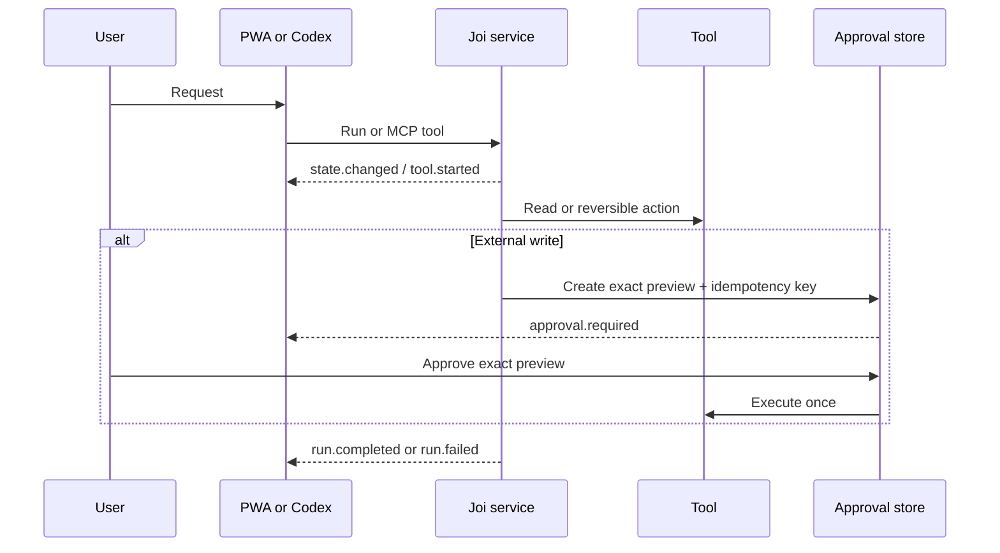

# Architecture

Joi uses one domain model and one action policy across every surface. The PWA calls the REST/SSE API; Codex calls the same service through Streamable HTTP MCP. Neither surface owns a separate prompt, connector implementation, memory model, or approval policy.

## Runtime boundaries

- `packages/contracts` is the public schema boundary. Zod validates run inputs, events, memory, tasks, approvals, automations, connectors, profiles, and capability flags.
- `packages/core` owns tenant-scoped domain behavior, action-risk decisions, idempotency, audit records, avatar mappings, and connector abstractions.
- `apps/agent` owns transport, authentication, the Agents SDK orchestration path, SSE run broker, and MCP transport.
- `apps/web` owns presentation and uses a server-side proxy so the agent bearer token never reaches browser JavaScript.
- `plugins/joi-assistant` packages the supported Codex workflows and local beta MCP profile.

## State flow

## Persistence contract

The local beta deliberately uses in-memory repositories. `database/migrations/001_initial.sql` defines the production data shape and row-level security contract. A production adapter must open each transaction with `SET LOCAL app.user_id = ...`, use a non-owner application role so RLS applies, encrypt connector secrets outside general application data, and verify deletion across relational rows, vectors, objects, queues, logs, and provider credentials.
